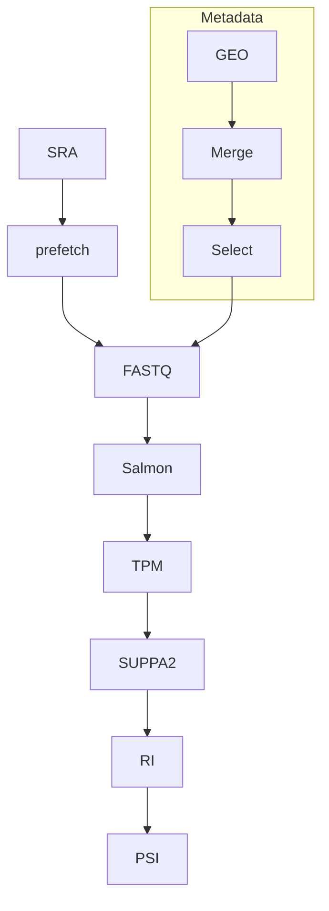

# Transcriptome-AutoPipeline


An automated, reproducible RNA-seq workflow for processing public transcriptomic datasets from raw sequencing data to biologically interpretable splicing outputs, with a specific focus on retained intron (RI) events and snoRT-oriented analysis.

---

## Overview

**Transcriptome-AutoPipeline** is a Python-based workflow designed to re-analyze public RNA-seq datasets (e.g., human cancer cohorts) in a fully automated and reproducible manner.

The pipeline performs the complete transition from raw sequencing data (SRA) to transcript-level quantification and alternative splicing analysis. It supports both full dataset processing and biologically informed sample selection through metadata integration.

The primary biological objective of this workflow is to enable the identification and quantification of **retained intron (RI)** events, which serve as a computational entry point for studying **snoRNA-retaining transcripts (snoRTs)**.

---

## Biological Context

Many small nucleolar RNAs (snoRNAs) are encoded within intronic regions of host genes. Under normal splicing conditions, these introns are removed and snoRNAs are processed independently.

However, when **intron retention** occurs, intronic regions containing snoRNA sequences may remain embedded within transcript isoforms. These transcripts are referred to as:

**snoRNA-retaining transcripts (snoRTs)**

Because of this, the detection and quantification of retained intron events provides a biologically meaningful strategy to identify candidate snoRT-associated transcripts in RNA-seq datasets.

---

## Pipeline Flowchart

```## Pipeline Flowchart



---

## Key Features

- Automated download of SRA datasets using `prefetch`
- FASTQ generation via `fasterq-dump`
- Transcriptome indexing and quantification using `Salmon`
- Transcript-level TPM matrix construction
- Integration of GEO and SRA metadata for biologically informed sample selection
- SUPPA2-based alternative splicing event generation
- PSI calculation focused on **retained intron (RI)** events
- Fully reproducible pipeline from raw data to splicing profiles

---

## Repository Structure

```
Transcriptome-AutoPipeline/
│
├── scripts/
│   ├── transcriptome_pipeline.py
│   ├── transcriptome_pipeline_selected.py
│   └── extract_geo_metadata.py
│
├── SraRunTable.txt or SraRunTable.csv
├── GSE181294_conditions.csv
├── gencode.v43.transcripts.fa.gz
├── gencode.v43.annotation.gtf
│
├── fastq_output/
├── results/
├── salmon_index/
├── events_ioe/
└── suppa_results/
```

---

## Pipeline Workflow

### 1. Full Transcriptome Processing

```bash
python3 scripts/transcriptome_pipeline.py
```

**Steps**

1. Parse SRR IDs
2. Download SRA files
3. Convert to FASTQ
4. Build Salmon index
5. Quantify transcript abundance
6. Build TPM matrix
7. Generate splicing events (SUPPA2)
8. Calculate PSI (Retained Intron)

---

### 2. Metadata Integration

```bash
python3 scripts/extract_geo_metadata.py
```

Outputs:

* `merged_SRA_GEO.csv`
* `selected_SRR_ids.txt`

---

### 3. Selected Sample Processing

```bash
python3 scripts/transcriptome_pipeline_selected.py
```

---

## Core Outputs

### Expression

* `quant.sf`
* `TPM_SUPPA2_final.tsv`

### Splicing

* `events_ioe/events_RI_strict.ioe`
* `suppa_results/RI.psi`

---

## Biological Interpretation

The pipeline focuses on **retained intron (RI)** events:

1. Transcript isoforms quantified
2. Intron retention detected
3. PSI measures inclusion level
4. snoRNA-containing introns → candidate snoRTs

---

## Requirements

* Python >= 3.8
* pandas
* SRA Toolkit
* Salmon
* SUPPA2

```bash
pip install pandas
vdb-config -i
```

---

## Future Work 🚀

This pipeline establishes the computational foundation for snoRT discovery. The following extensions will significantly enhance its biological impact:

### 1. snoRT Detection Module

* Intersect RI events with annotated snoRNA genomic coordinates
* Identify introns containing snoRNAs
* Map retained introns to transcript isoforms
* Generate candidate snoRT list

### 2. Differential Splicing Analysis

* Compare PSI between tumor vs normal
* Identify condition-specific RI events
* Detect biologically relevant intron retention patterns

### 3. Integration with Gene Expression

* Combine TPM and PSI data
* Identify transcripts with both high expression and high intron retention
* Prioritize functional snoRT candidates

### 4. Quality Control Integration

* Add FastQC / MultiQC module
* Optional trimming (Cutadapt/Trimmomatic)

### 5. Paired-End Support

* Extend Salmon quantification for paired-end datasets
* Improve compatibility with diverse RNA-seq experiments

---

## Summary

Transcriptome-AutoPipeline provides a robust and automated framework for RNA-seq analysis, focusing on transcript quantification and retained intron detection.

It enables:

* transcript-level analysis
* alternative splicing profiling
* snoRT-oriented research in cancer transcriptomics

---

## Author

Kiarash Babaei
