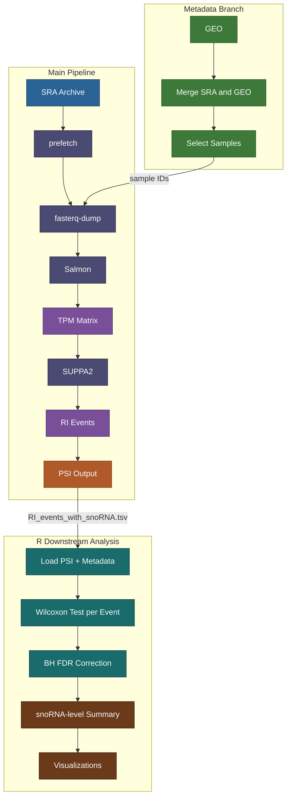

## Overview
# Transcriptome-AutoPipeline


An automated, reproducible RNA-seq workflow for processing public transcriptomic datasets from raw sequencing data to biologically interpretable splicing outputs, with a specific focus on retained intron (RI) events and snoRNA-retaining transcript (snoRT) discovery.

---

## Table of Contents

- [Overview](#overview)
- [Biological Context](#biological-context)
- [Pipeline Flowchart](#pipeline-flowchart)
- [Key Features](#key-features)
- [Repository Structure](#repository-structure)
- [Pipeline Workflow](#pipeline-workflow)
- [Core Outputs](#core-outputs)
- [Downstream Statistical Analysis (R)](#downstream-statistical-analysis-r)
- [Requirements](#requirements)
- [Future Work](#future-work)
- [Author](#author)

---

## Overview

**Transcriptome-AutoPipeline** is a Python + R workflow designed to re-analyze public RNA-seq datasets (e.g., human cancer cohorts) in a fully automated and reproducible manner.

The pipeline performs the complete transition from raw sequencing data (SRA) to transcript-level quantification, alternative splicing analysis, and downstream statistical testing of retained intron (RI) events across sample groups. It supports both full dataset processing and biologically informed sample selection through metadata integration.

The primary biological objective of this workflow is to enable the identification and quantification of **retained intron (RI)** events, which serve as a computational entry point for studying **snoRNA-retaining transcripts (snoRTs)**.

---

## Biological Context

Many small nucleolar RNAs (snoRNAs) are encoded within intronic regions of host genes. Under normal splicing conditions, these introns are removed and snoRNAs are processed independently.

However, when **intron retention** occurs, intronic regions containing snoRNA sequences may remain embedded within transcript isoforms. These transcripts are referred to as **snoRNA-retaining transcripts (snoRTs)**.

The detection and quantification of retained intron events therefore provides a biologically meaningful strategy to identify candidate snoRT-associated transcripts in RNA-seq datasets. This pipeline operationalizes that strategy across a multi-group cancer cohort.

---

## Pipeline Flowchart



**Step legend:**

| Step | Description |
|---|---|
| **SRA Archive** | NCBI public sequencing data — raw reads |
| **prefetch** | Downloads `.sra` binary files via SRA Toolkit |
| **fasterq-dump** | Converts `.sra` to `.fastq` read files |
| **Salmon** | Quasi-mapping transcript-level quantification |
| **TPM Matrix** | Normalized expression table (`TPM_SUPPA2_final.tsv`) |
| **SUPPA2** | Alternative splicing event generation from GTF + TPM |
| **RI Events** | Retained intron events (`.ioe` format) |
| **PSI Output** | Percent Spliced In scores per sample (`RI.psi`) |
| **GEO** | Gene Expression Omnibus — sample condition metadata |
| **Merge** | Joins SRA run table with GEO condition labels |
| **Select** | Filters to biologically relevant sample subset |
| **Wilcoxon Test** | Per-event group comparison across contrasts |
| **BH FDR** | Multiple testing correction (Benjamini–Hochberg) |
| **snoRNA Summary** | Aggregated significant events per snoRNA per contrast |

---

## Key Features

- Automated download of SRA datasets using `prefetch`
- FASTQ generation via `fasterq-dump`
- Transcriptome indexing and quantification using `Salmon`
- Transcript-level TPM matrix construction
- Integration of GEO and SRA metadata for biologically informed sample selection
- SUPPA2-based alternative splicing event generation
- PSI calculation focused on **retained intron (RI)** events
- **R-based downstream analysis**: Wilcoxon testing, BH FDR correction, snoRNA-level summarization, and differential splicing visualization
- Fully reproducible pipeline from raw data to statistical results

---

## Repository Structure

```
Transcriptome-AutoPipeline/
│
├── scripts/
│   ├── transcriptome_pipeline.py
│   ├── transcriptome_pipeline_selected.py
│   └── extract_geo_metadata.py
│
├── figures/
│   └── heatmap_snorna_RI.png          ← snoRNA × contrast heatmap
│
├── SraRunTable.csv
├── GSE181294_conditions.csv
├── gencode.v43.transcripts.fa.gz
├── gencode.v43.annotation.gtf
│
├── fastq_output/
├── results/
│   └── event_dPSI_results.tsv         ← R output: per-event statistics
├── salmon_index/
├── events_ioe/
└── suppa_results/
    ├── RI_events_with_snoRNA.tsv      ← annotated PSI matrix (input to R)
    └── RI.psi
```

---

## Pipeline Workflow

### 1. Full Transcriptome Processing

```bash
python3 scripts/transcriptome_pipeline.py
```

Steps: parse SRR IDs → download SRA → convert to FASTQ → build Salmon index → quantify → build TPM matrix → generate splicing events (SUPPA2) → calculate PSI.

### 2. Metadata Integration

```bash
python3 scripts/extract_geo_metadata.py
```

Outputs: `merged_SRA_GEO.csv`, `selected_SRR_ids.txt`

### 3. Selected Sample Processing

```bash
python3 scripts/transcriptome_pipeline_selected.py
```

---

## Core Outputs

| File | Stage | Description |
|---|---|---|
| `quant.sf` | Salmon | Per-transcript quantification |
| `TPM_SUPPA2_final.tsv` | Salmon | TPM matrix across all samples |
| `events_ioe/events_RI_strict.ioe` | SUPPA2 | Retained intron event definitions |
| `suppa_results/RI.psi` | SUPPA2 | PSI values per RI event per sample |
| `RI_events_with_snoRNA.tsv` | Annotation | PSI matrix annotated with snoRNA host gene |
| `event_dPSI_results.tsv` | R | ΔPSI, p-value, FDR per event per contrast |

---

## Downstream Statistical Analysis (R)

This section documents the R-based differential splicing analysis performed on the SUPPA2 PSI output. It implements the **snoRT Detection** and **Differential Splicing Analysis** components of the pipeline.

---

### Sample Metadata

Samples from `SraRunTable.csv` were classified into four biological groups using conditional logic on the `condition`, `grade`, and `tissue` metadata columns (adjacent normal tissue was mapped to the Normal group):

| Group | N samples |
|---|---|
| Healthy | 24 |
| High-grade tumor | 36 |
| Low-grade tumor | 44 |
| Adjacent Normal | 64 |
| **Total** | **168** |

```r
meta <- meta_raw %>%
  transmute(
    sample = Run,
    group = case_when(
      str_detect(tolower(condition), "healthy") ~ "Healthy",
      str_detect(tolower(condition), "normal")  ~ "Normal",
      str_detect(tolower(condition), "low")     ~ "Low",
      str_detect(tolower(condition), "high")    ~ "High",
      str_detect(tolower(grade),     "low")     ~ "Low",
      str_detect(tolower(grade),     "high")    ~ "High",
      str_detect(tolower(tissue), "adjacent") &
        str_detect(tolower(tissue), "normal")   ~ "Normal",
      TRUE ~ NA_character_
    )
  )
```

---

### Statistical Design

**202 unique RI events**, each annotated with a snoRNA host gene, were tested across four contrasts:

| Contrast | Biological Question |
|---|---|
| `Low_vs_Healthy` | Does low-grade tumor alter intron retention vs. healthy? |
| `High_vs_Healthy` | Does high-grade tumor alter intron retention vs. healthy? |
| `Normal_vs_Healthy` | Does field cancerization affect intron retention? |
| `Low_vs_High` | Does tumor grade drive differential intron retention? |

For each (event × contrast) pair:
- **Test**: Wilcoxon rank-sum (non-parametric, robust to PSI distribution skew)
- **Effect size**: ΔPSI = mean(PSI group1) − mean(PSI group2)
- **Multiple testing**: Benjamini–Hochberg FDR correction, applied per contrast

```r
run_wilcox <- function(df, g1, g2) {
  df2 <- df %>% filter(group %in% c(g1, g2)) %>% drop_na(PSI)
  tibble(
    p        = suppressWarnings(wilcox.test(PSI ~ group, data = df2)$p.value),
    deltaPSI = mean(df2$PSI[df2$group == g1], na.rm = TRUE) -
               mean(df2$PSI[df2$group == g2], na.rm = TRUE)
  )
}

event_results <- contrasts %>%
  pmap_dfr(function(contrast, g1, g2) {
    psi_long %>%
      group_by(eventID, snoRNAName) %>%
      group_modify(~run_wilcox(.x, g1, g2)) %>%
      ungroup() %>%
      mutate(contrast = contrast, FDR = p.adjust(p, method = "BH")) %>%
      relocate(contrast, eventID, snoRNAName, deltaPSI, p, FDR)
  })
```

---

### Results: Significant RI Events

**At FDR < 0.05 (any effect size):**

| Contrast | Sig. Events | min FDR |
|---|---|---|
| Normal_vs_Healthy | **17** | 8.64 × 10⁻⁶ |
| Low_vs_Healthy | **8** | 7.43 × 10⁻¹¹ |
| High_vs_Healthy | 5 | 5.48 × 10⁻⁴ |
| Low_vs_High | **0** | 3.21 × 10⁻¹ |

**At FDR < 0.05 AND |ΔPSI| ≥ 0.10 (biologically meaningful threshold):**

| Contrast | Sig. Events |
|---|---|
| Normal_vs_Healthy | **6** |
| Low_vs_Healthy | **4** |
| High_vs_Healthy | 0 |
| Low_vs_High | 0 |

> **Key observations:**
> - `Low_vs_High` yielded no significant events at any threshold, indicating that tumor grade alone does not drive differential intron retention.
> - `Normal_vs_Healthy` produced the most events overall (17 at FDR < 0.05; 6 with |ΔPSI| ≥ 0.10), consistent with **field cancerization** — widespread transcriptome alterations in histologically normal tissue adjacent to tumors.
> - High-grade tumors showed statistically significant events (n=5) but none exceeded the |ΔPSI| ≥ 0.10 threshold, suggesting smaller-magnitude but statistically detectable splicing shifts.

---

### Results: snoRNA-Level Summary

After per-event testing, results were aggregated by snoRNA host to count how many RI events per snoRNA reached FDR < 0.05 in each contrast:

```r
snorna_summary <- event_results %>%
  group_by(contrast, snoRNAName) %>%
  summarise(n_sig = sum(FDR < 0.05, na.rm = TRUE), .groups = "drop") %>%
  arrange(desc(n_sig))
```

**Top snoRNAs by significant RI event count:**

| Rank | snoRNA | Contrast | n_sig | Note |
|---|---|---|---|---|
| 1 | **SNORD50B** | Normal_vs_Healthy | **4** | Strongest overall signal |
| 2 | **SNORD50B** | Low_vs_Healthy | **3** | Consistent across 2 contrasts |
| 3 | **SNORD47** | Normal_vs_Healthy | **2** | 2nd-ranking host gene |
| 4 | SNORA32 | High_vs_Healthy | 1 | Present in 3 contrasts |
| 4 | SNORA32 | Low_vs_Healthy | 1 | |
| 4 | SNORA32 | Normal_vs_Healthy | 1 | |
| 4 | SNORD2 | High/Low_vs_Healthy | 1 each | Grade-independent |
| 4 | SNORD23 | High/Low_vs_Healthy | 1 each | Grade-independent |
| 4 | SNORD76 | High/Low_vs_Healthy | 1 each | Grade-independent |
| 4 | SNORD77 | High/Low_vs_Healthy | 1 each | Grade-independent |

**Cross-contrast signal (snoRNAs appearing in ≥ 2 contrasts):**

| snoRNA | # Contrasts with ≥1 sig event | Total sig events |
|---|---|---|
| **SNORD50B** | 2 (Low, Normal vs Healthy) | **7** |
| **SNORA32** | 3 (High, Low, Normal vs Healthy) | **3** |
| SNORD2 | 2 (High, Low vs Healthy) | 2 |
| SNORD23 | 2 (High, Low vs Healthy) | 2 |
| SNORD76 | 2 (High, Low vs Healthy) | 2 |
| SNORD77 | 2 (High, Low vs Healthy) | 2 |

> **SNORD50B** is the top snoRT candidate, accumulating 7 total significant events across two independent tumor-vs-healthy contrasts. **SNORA32** shows the broadest cross-contrast presence (3 of 4 contrasts), suggesting a constitutively altered retention pattern regardless of tumor grade.

---

### Visualization: Heatmap of Significant RI Events

The heatmap below shows the number of significant RI events (FDR < 0.05) for each snoRNA (rows) across the four contrasts (columns). Color scales from light orange (n_sig = 0) through orange to deep red (n_sig = 4).


**Reading the heatmap:**
- **SNORD50B** is clearly the hottest row — deep red in `Normal_vs_Healthy` (n=4) and strong orange in `Low_vs_Healthy` (n=3), with no signal in the other two contrasts.
- **SNORD47** shows a distinct orange band only in `Normal_vs_Healthy` (n=2).
- **SNORD76, SNORD77, SNORD23, SNORD2, SNORA32** each show mild but consistent signal in both `High_vs_Healthy` and `Low_vs_Healthy` — tumor-vs-healthy changes that are grade-independent.
- The `Low_vs_High` column is entirely blank, confirming no differential intron retention between tumor grades.
- The light orange background across most rows (n_sig = 0) highlights the specificity of the signal to the few snoRNAs listed above.

> **To reproduce:** commit the heatmap image to `figures/heatmap_snorna_RI.png` in the repository root. The path in the markdown above (`figures/heatmap_snorna_RI.png`) is relative to the README location.

---

### Full R Heatmap Code

```r
library(dplyr); library(tidyr); library(ggplot2)

heat_long <- snorna_summary %>%
  pivot_wider(names_from = contrast, values_from = n_sig, values_fill = 0) %>%
  pivot_longer(-snoRNAName, names_to = "contrast", values_to = "n_sig")

ggplot(heat_long, aes(x = contrast, y = snoRNAName, fill = n_sig)) +
  geom_tile(color = "white") +
  geom_text(aes(label = n_sig), size = 3) +
  scale_fill_gradient2(
    low = "white", mid = "orange", high = "red",
    midpoint = 1, limits = c(0, 4)
  ) +
  labs(
    title = "Heatmap of significant RI events",
    x = "Contrast", y = "snoRNA", fill = "n_sig"
  ) +
  theme_minimal() +
  theme(
    axis.text.y  = element_text(size = 8),
    axis.text.x  = element_text(angle = 45, hjust = 1),
    plot.title   = element_text(face = "bold")
  )
```

---

### R Output Files

| File | Description |
|---|---|
| `results/event_dPSI_results.tsv` | Per-event results: contrast, eventID, snoRNAName, ΔPSI, p-value, FDR |
| `figures/heatmap_snorna_RI.png` | snoRNA × contrast heatmap of n_sig (FDR < 0.05) |

---

## Requirements

### Python

- Python ≥ 3.8
- pandas
- SRA Toolkit
- Salmon
- SUPPA2

```bash
pip install pandas
vdb-config -i
```

### R

- R ≥ 4.4.0
- `readr`, `dplyr`, `tidyr`, `stringr`, `purrr`, `tibble`, `ggplot2`

```r
install.packages(c("readr","dplyr","tidyr","stringr","purrr","tibble","ggplot2"))
```

---

## Future Work 🚀

- [ ] **QC integration** — Add FastQC / MultiQC module + optional trimming (Cutadapt/Trimmomatic)
- [ ] **Paired-end support** — Extend Salmon quantification for paired-end datasets
- [ ] **snoRT isoform confirmation** — Intersect candidate RI events with snoRNA genomic coordinates to confirm snoRNA sequence is embedded in the retained intron
- [ ] **Expression integration** — Combine TPM and PSI to prioritize events with both high expression and high intron retention
- [ ] **Gene ontology / pathway analysis** — Functional annotation of host genes with significant RI events
- [ ] **Survival correlation** — Link snoRT candidates to clinical outcomes using TCGA metadata
- [ ] **Expanded cohort** — Apply pipeline to additional GEO datasets for cross-cohort validation of SNORD50B and SNORA32 findings

---

## Biological Summary

Transcriptome-AutoPipeline provides a robust and automated framework for RNA-seq analysis, focusing on transcript quantification and retained intron detection in a cancer cohort context.

Across **168 samples** (Healthy, Low-grade, High-grade tumor, Adjacent Normal) and **202 annotated RI events**, the downstream R analysis identified:

- **SNORD50B** as the top snoRT candidate host — 4 significant events in adjacent normal tissue and 3 in low-grade tumor vs. healthy
- **SNORA32** as the most broadly altered snoRNA — signal in 3 of 4 contrasts, suggesting a grade-independent retention change
- **Zero significant events** in `Low_vs_High`, indicating tumor grade does not drive differential intron retention
- The dominant signal in `Normal_vs_Healthy` (17 events at FDR < 0.05), consistent with field cancerization

---

## Author

Kiarash Babaei
